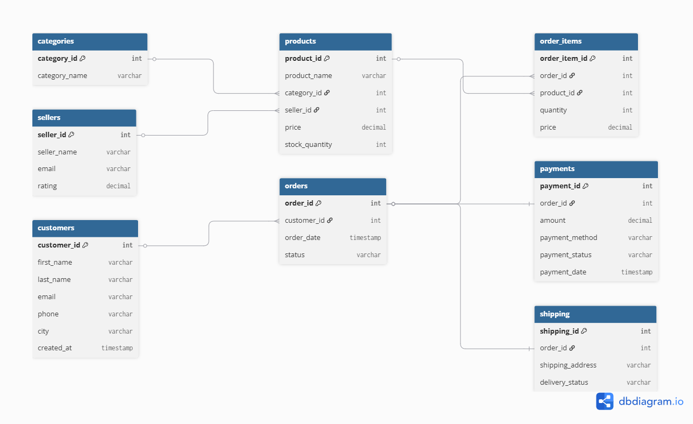
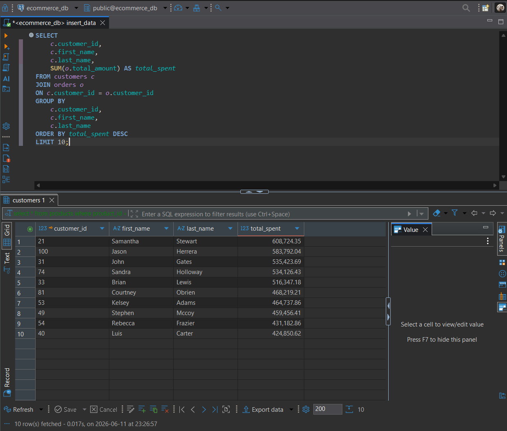
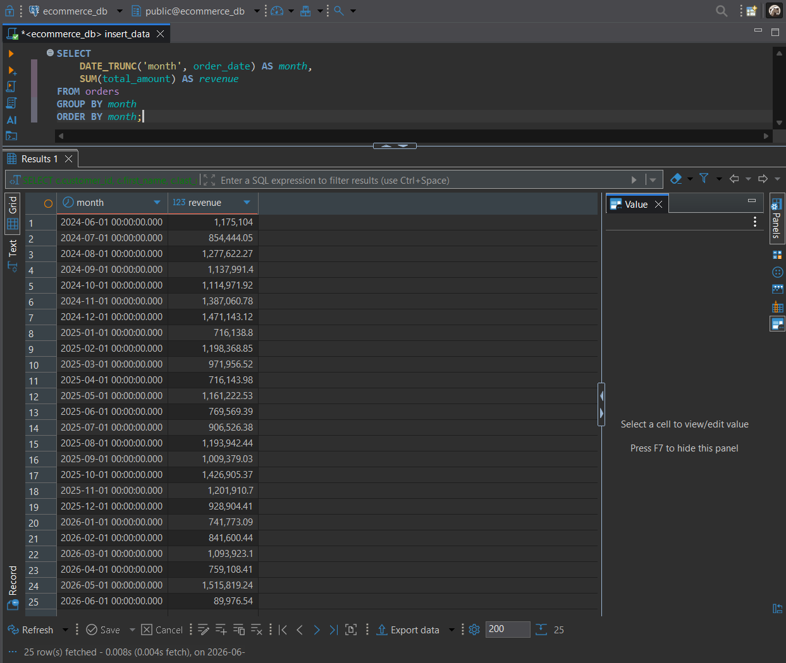
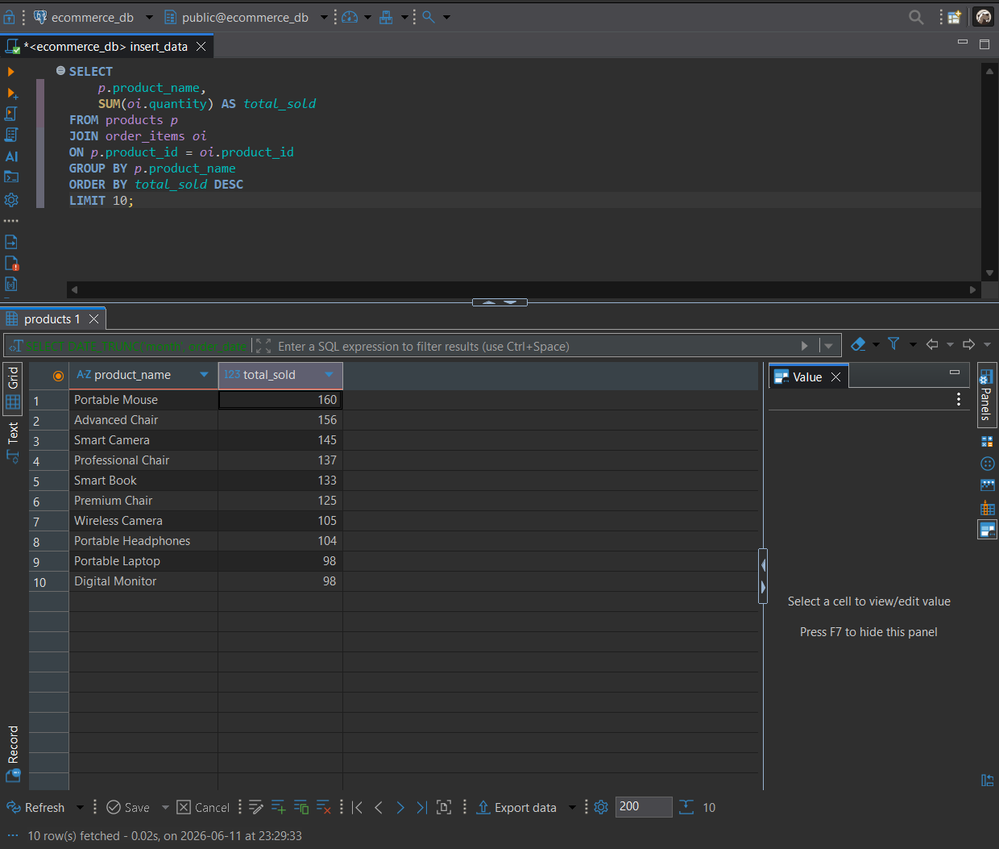
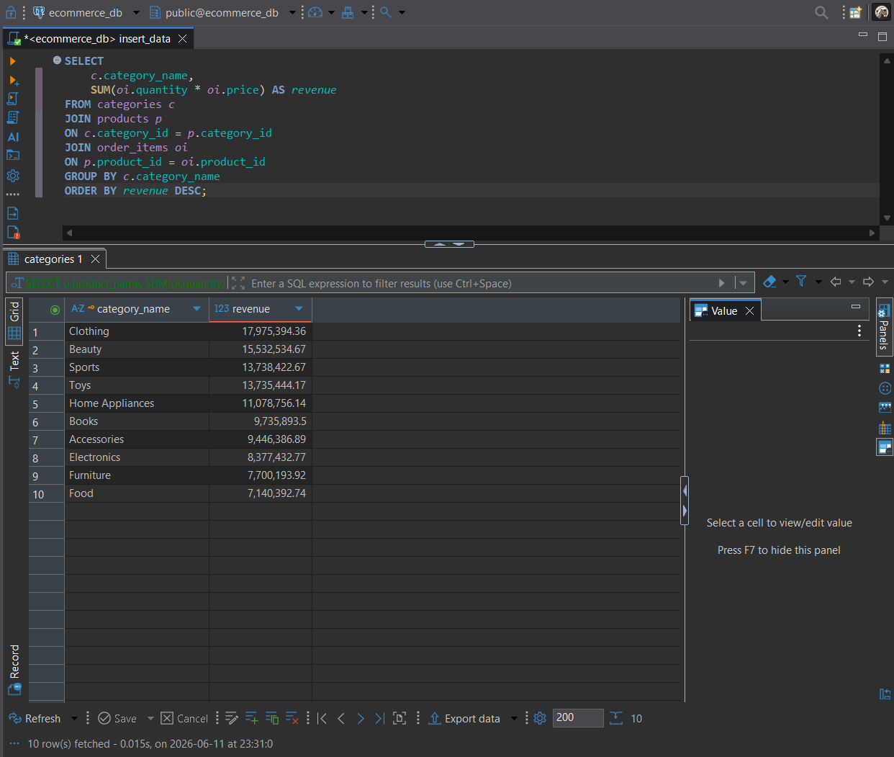
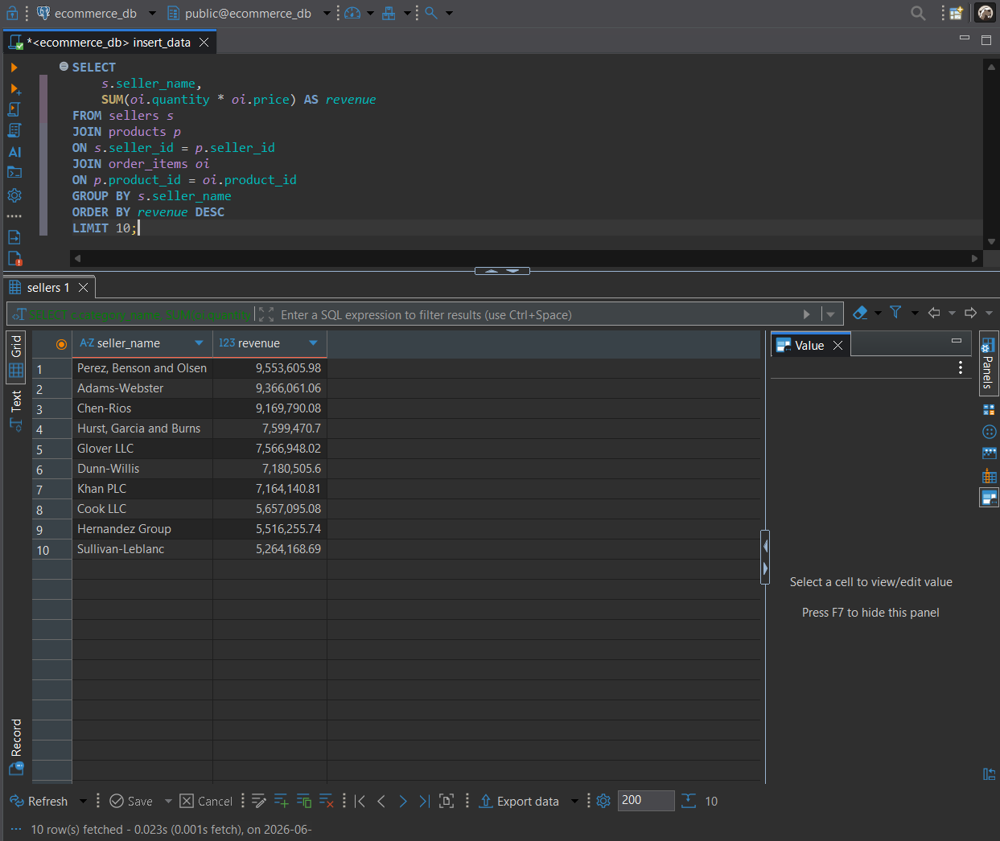

# E-Commerce SQL Analytics System

## Setup

1. Create a PostgreSQL database.
2. Execute database/schema.sql.
3. Run seed files in the following order:

- categories.sql
- customers.sql
- sellers.sql
- products.sql
- orders.sql
- order_items.sql
- payments.sql
- shipping.sql

4. Execute analytics queries from the queries folder.

## Overview

The E-Commerce SQL Analytics System is a PostgreSQL-based database project designed to simulate a real-world e-commerce platform.

This project demonstrates database design, normalization, SQL query development, business analytics, query optimization, stored procedures, functions, and transaction management.

The database was built from scratch and populated with realistic sample data generated using Python and Faker.

---

## Objectives

* Design a normalized relational database
* Create and manage database schemas using PostgreSQL
* Implement CRUD operations
* Perform data analysis using SQL
* Optimize query performance using indexes
* Develop stored procedures and functions
* Demonstrate transaction management and ACID properties

---

## Technologies Used

* PostgreSQL
* DBeaver
* Python
* Faker
* Git
* GitHub

---

## Database Design

### Entity Relationship Diagram

Add the exported ER diagram inside the `diagrams` folder and display it here:




---

## Database Schema

The database contains the following tables:

| Table       | Description                 |
| ----------- | --------------------------- |
| customers   | Customer information        |
| categories  | Product categories          |
| sellers     | Seller information          |
| products    | Product catalog             |
| orders      | Customer orders             |
| order_items | Products included in orders |
| payments    | Payment details             |
| shipping    | Shipping information        |

---

## Database Statistics

| Entity           | Records |
| ---------------- | ------- |
| Categories       | 10      |
| Customers        | 100     |
| Sellers          | 20      |
| Products         | 200     |
| Orders           | 500     |
| Order Items      | 1500    |
| Payments         | 500     |
| Shipping Records | 500     |

---

## SQL Concepts Implemented

### Database Design

* Entity Relationship Modeling
* Database Normalization (1NF, 2NF, 3NF)
* Primary Keys
* Foreign Keys
* Constraints

### CRUD Operations

* INSERT
* SELECT
* UPDATE
* DELETE

### Joins

* INNER JOIN
* LEFT JOIN
* RIGHT JOIN
* FULL JOIN

### Subqueries

* Single-row subqueries
* Multi-row subqueries
* Nested subqueries

### Advanced SQL

* Indexing
* Stored Procedures
* Functions
* Transactions
* Query Optimization

---

## Business Analytics Queries

The project answers common business questions such as:

### Customer Analytics

* Top customers by spending
* Customer order history
* Customer lifetime value

### Revenue Analytics

* Monthly revenue trends
* Average order value
* Revenue by category

### Product Analytics

* Best-selling products
* Product inventory analysis
* Low-stock products

### Seller Analytics

* Seller revenue ranking
* Product performance by seller

### Payment Analytics

* Payment status distribution
* Payment method analysis

---

## Project Structure

```text
ecommerce-sql-analytics-system/

├── database/
│   ├── schema.sql
│   ├── categories.sql
│   ├── customers.sql
│   ├── sellers.sql
│   ├── products.sql
│   ├── orders.sql
│   ├── order_items.sql
│   ├── payments.sql
│   └── shipping.sql
│
├── diagrams/
│   └── er_diagram.png
│
├── docs/
│   ├── normalization.md
│   └── project_plan.md
│
├── optimization/
│   ├── indexes.sql
│   └── performance.md
│
├── procedures/
│   ├── procedures.sql
│   └── functions.sql
│
├── queries/
│   ├── crud_operations.sql
│   ├── joins.sql
│   ├── subqueries.sql
│   └── business_analysis.sql
│
├── transactions/
│   └── order_transaction.sql
│
├── scripts/
│   └── generate_data.py
│
└── README.md
```

---

## Business Analytics Dashboard

### Top Customers by Spending

Identifies the highest-value customers based on total purchase amount.




### Monthly Revenue Trend

Shows revenue generated each month.




### Best Selling Products

Highlights products with the highest sales volume.




### Revenue by Category

Shows which product categories generate the most revenue.




### Seller Performance

Ranks sellers by total revenue generated.



---

## Key Insights

- Identified the top revenue-generating product categories.
- Analyzed customer spending behavior across orders.
- Ranked sellers based on total generated revenue.
- Evaluated monthly revenue trends.
- Monitored low-stock inventory items.

## Query Optimization

Indexes were created on frequently queried columns to improve performance.

Examples:

* customers(email)
* orders(customer_id)
* products(category_id)
* products(seller_id)
* order_items(order_id)
* order_items(product_id)

Performance was analyzed using:

```sql
EXPLAIN ANALYZE
```

---

## Stored Procedures and Functions

### Procedure

* Update product inventory

### Functions

* Customer lifetime value
* Total orders per customer

---

## Transaction Management

The project demonstrates:

* BEGIN
* COMMIT
* ROLLBACK

to ensure ACID-compliant operations during order processing.

---

## Learning Outcomes

Through this project, I gained hands-on experience in:

* Relational database design
* PostgreSQL development
* Data generation and management
* Business analytics using SQL
* Query optimization techniques
* Advanced SQL programming
* Transaction management

---

## Author

Haroon

Machine Learning Student | SQL & Data Analytics Enthusiast
